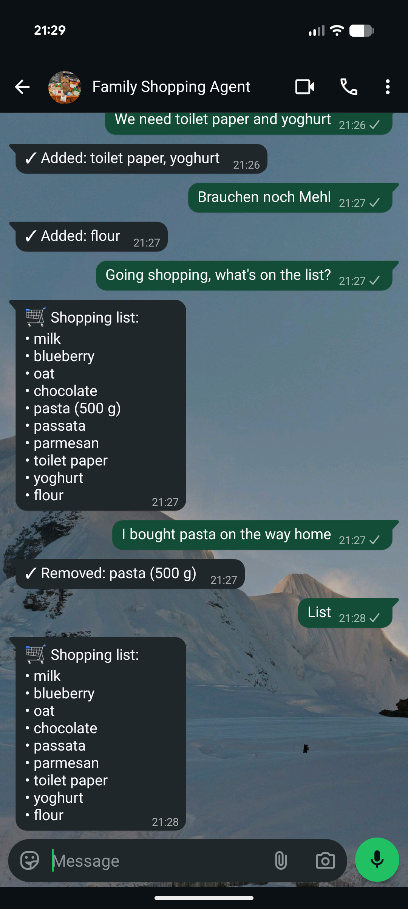
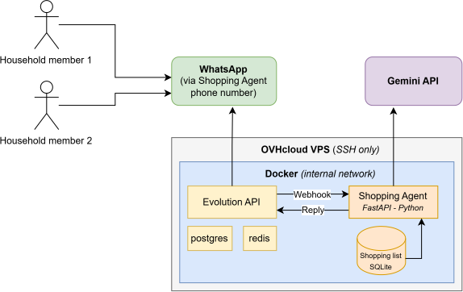

# Shopping Agent

A WhatsApp-based shared shopping list for a household. Members send
natural-language messages ("add milk and 2 kg potatoes") to a dedicated
WhatsApp number; a FastAPI app parses them with Gemini Flash and keeps the
list in SQLite. The whole thing runs in Docker Compose — the same stack
locally and on a VPS.

See [PLAN.md](PLAN.md) for the full architecture and roadmap.

<p align="center">
  
</p>

## How it works

<p align="center">
  
</p>

Four services on a private Docker network:

| Service | Role |
|---|---|
| `evolution` | [Evolution API](https://github.com/EvolutionAPI/evolution-api) — bridges the dedicated WhatsApp account (via Baileys) |
| `app` | Python FastAPI app — webhook auth, sender whitelist, rate limit, Gemini parsing, SQLite |
| `postgres`, `redis` | storage/cache backing Evolution (the shopping list itself lives in the app's SQLite) |

Incoming messages flow `WhatsApp → evolution → POST /webhook/<token> → app`,
entirely inside the Docker network. Nothing needs to be reachable from the
internet: Evolution's connection to WhatsApp is outbound.

## Prerequisites

- Docker + Docker Compose v2.24+ (the prod override uses `!override`)
- A dedicated WhatsApp account on a phone you control (for QR pairing)
- A [Google AI Studio](https://aistudio.google.com/apikey) API key for Gemini

## Running locally (Linux / WSL)

1. Clone the repo and create your `.env`:

   ```bash
   cp .env.example .env
   # generate secrets
   openssl rand -hex 32   # use for EVOLUTION_API_KEY
   openssl rand -hex 32   # use for WEBHOOK_TOKEN
   ```

   Set `ALLOWED_NUMBERS` to the WhatsApp numbers allowed to use the list
   (digits only, no `+`, comma-separated), e.g. `41791234567,41797654321`.

2. Bring up the stack:

   ```bash
   docker compose up -d --build
   ```

   The first build pulls Postgres, Redis, Evolution API and builds the Python
   app.

3. Wait ~20 s, then check:

   ```bash
   docker compose ps
   curl -s http://localhost:8000/health   # → {"ok":true}
   ```

## Pairing the WhatsApp account (one-time)

> **Already paired?** Check first — if this prints `"state": "open"`, skip
> the steps below (there is nothing to pair, and the QR call will return
> junk):
>
> ```bash
> set -a; source .env; set +a
> curl -s http://localhost:8080/instance/connectionState/$EVOLUTION_INSTANCE_NAME \
>   -H "apikey: $EVOLUTION_API_KEY" | jq .
> ```

**Step 1** — create the Evolution instance and register the webhook:

```bash
set -a; source .env; set +a   # load env vars into the shell

curl -s -X POST http://localhost:8080/instance/create \
  -H "apikey: $EVOLUTION_API_KEY" \
  -H 'Content-Type: application/json' \
  -d "{
    \"instanceName\": \"$EVOLUTION_INSTANCE_NAME\",
    \"integration\": \"WHATSAPP-BAILEYS\",
    \"qrcode\": true,
    \"webhook\": {
      \"url\": \"http://app:8000/webhook/$WEBHOOK_TOKEN\",
      \"byEvents\": false,
      \"base64\": false,
      \"events\": [\"MESSAGES_UPSERT\"]
    }
  }" | jq .
```

**Step 2** — render a fresh QR code and scan it immediately. The code rotates
every ~40 s, so have the phone ready first (WhatsApp → Settings → Linked
Devices → Link a device). The quickest way is drawing it straight into the
terminal with `qrencode` (`sudo apt install qrencode`):

```bash
curl -s http://localhost:8080/instance/connect/$EVOLUTION_INSTANCE_NAME \
  -H "apikey: $EVOLUTION_API_KEY" | jq -r '.code' | qrencode -t ansiutf8
```

Make the terminal window large enough that the whole square is visible. If
you miss the window, just run the command again — `/instance/connect`
returns a fresh code each call.

<details>
<summary>Alternative: save the QR as a PNG and open it</summary>

```bash
curl -s http://localhost:8080/instance/connect/$EVOLUTION_INSTANCE_NAME \
  -H "apikey: $EVOLUTION_API_KEY" \
  | jq -r '.base64' \
  | python3 -c "import sys,base64; d=sys.stdin.read().strip().split(',',1)[-1]; open('/tmp/qr.png','wb').write(base64.b64decode(d))"

xdg-open /tmp/qr.png                        # Linux
explorer.exe "$(wslpath -w /tmp/qr.png)"    # WSL
```

</details>

## Using it

From a whitelisted WhatsApp account, message the dedicated number:

- `add milk and 2 kg potatoes` → **✓ Added: milk, potatoes (2 kg)**
- `add 3 kg potatoes` again → **✓ Updated: potatoes (3 kg)** (no duplicates)
- `what's on the list?` → the current list
- `remove milk` → **✓ Removed: milk**
- `clear the list` → asks you to reply `yes` within 2 minutes to confirm

The list lives in `app/data/shopping.db` (SQLite), persisted across restarts.

Watch logs to debug:

```bash
docker compose logs -f app
docker compose logs -f evolution
```

## Stop / reset

```bash
docker compose down              # stop, keep data
docker compose down -v           # stop and wipe Postgres + Evolution session
                                 # (you will need to re-pair the QR)
rm -f app/data/shopping.db       # wipe the shopping list only
```

## Development

Requires [uv](https://docs.astral.sh/uv/). From `app/`:

```bash
uvx ruff format . && uvx ruff check .   # format + lint (CI enforces both)
uv run pytest tests/ -q                 # end-to-end tests (Gemini stubbed)
```

CI (`.github/workflows/ci.yml`) runs ruff, the tests, bandit, pip-audit, a
package build, a Docker build and a trivy image scan on every push.
Dependabot (`.github/dependabot.yml`) opens weekly dependency-bump PRs.

## Deploying to a VPS

Any small Debian-based VPS with Docker works (tested on Debian 12). The
deployment model is deliberately simple: clone the repo over a read-only
deploy key, copy `.env` once, and run the same Compose stack with a small
production override. Deploys are `git pull && docker compose up -d --build`,
wrapped in [`deploy.sh`](deploy.sh). No CI/CD, no registry, no reverse proxy
— nothing on this stack needs to be reachable from the internet.

The production override, [`docker-compose.prod.yml`](docker-compose.prod.yml),
changes two things: `restart: always` on all services, and
`ports: !override []` on `evolution` and `app`, which removes the localhost
port publishes entirely — the server's public attack surface is SSH and
nothing else.

### 1. Prepare the server

- Create a non-root user and add it to the `sudo` and `docker` groups.
- Key-only SSH: install your public key, then set
  `PasswordAuthentication no` and `PermitRootLogin no` in
  `/etc/ssh/sshd_config`. Optionally move SSH to a non-standard port.
- Firewall (ufw or your provider's edge firewall): allow **only the SSH
  port**. The stack publishes nothing, so nothing else needs to be open.
- `apt install unattended-upgrades` for automatic security patches.
- Check `docker compose version` — the override needs Compose v2.24+.

A convenient laptop-side `~/.ssh/config` entry (used by the commands below):

```
Host vps
    HostName <your-server>
    Port <your-ssh-port>
    User <your-user>
    IdentityFile ~/.ssh/<your-key>
    IdentitiesOnly yes
```

### 2. Get the code and secrets onto the server

On the server, generate a dedicated keypair and add the public half as a
**read-only deploy key** on your Git host (GitHub: repo → Settings → Deploy
keys). A deploy key beats a personal key on a server: the blast radius of a
leak is one repo, read-only.

```bash
ssh-keygen -t ed25519 -f ~/.ssh/id_ed25519_deploy -N ""
cat ~/.ssh/id_ed25519_deploy.pub   # paste this as the deploy key
```

SSH only auto-offers default key filenames, so tell it about this one in the
server's `~/.ssh/config`:

```
Host github.com
    IdentityFile ~/.ssh/id_ed25519_deploy
    IdentitiesOnly yes
```

Verify with `ssh -T git@github.com`, then clone:

```bash
git clone git@github.com:<owner>/<repo>.git ~/shopping-agent
```

Secrets never travel through git. From your local machine:

```bash
scp .env vps:shopping-agent/.env
```

Then, on the server, append this line to `.env` so plain `docker compose`
commands automatically pick up the production override:

```
COMPOSE_FILE=docker-compose.yml:docker-compose.prod.yml
```

Consider rotating `POSTGRES_PASSWORD`, `WEBHOOK_TOKEN` and
`EVOLUTION_API_KEY` to fresh values for production while you are at it.

To keep an existing shopping list, copy it **before** the first start:

```bash
scp app/data/shopping.db vps:shopping-agent/app/data/
```

### 3. First start

```bash
cd ~/shopping-agent
docker compose up -d --build
docker compose ps
```

### 4. Pair WhatsApp on the server

Pair fresh — don't copy an Evolution session volume from another machine;
cloned Baileys sessions cause flaky disconnects.

1. Temporarily re-add Evolution's port publish: comment out the
   `ports: !override []` lines under `evolution:` in
   `docker-compose.prod.yml` (don't commit this), then `docker compose up -d`.
2. Run the pairing steps from
   [Pairing the WhatsApp account](#pairing-the-whatsapp-account-one-time)
   directly on the server — the terminal `qrencode` variant works over SSH.
3. If the same WhatsApp account was paired to another machine before, remove
   that linked device on the phone and shut down the old stack
   (`docker compose down`) so two bots don't both answer.
4. Restore the override (`git checkout docker-compose.prod.yml`) and
   `docker compose up -d`.

For one-off API access later (debugging, re-pairing), either repeat the
temporary port publish, or tunnel: `ssh -L 8080:localhost:8080 vps` makes the
server's Evolution API available as `localhost:8080` on your machine without
opening anything to the internet.

### 5. Deploying updates

From your local machine, one command:

```bash
ssh vps 'cd shopping-agent && ./deploy.sh'
```

[`deploy.sh`](deploy.sh) pulls `main` (`--ff-only`), rebuilds, restarts and
prints `docker compose ps`. Compose only recreates containers whose config or
image actually changed — a code-only change bounces `app` alone; Postgres,
Redis and the WhatsApp session are untouched.

### 6. Backups

Two things hold state: the shopping list (`app/data/shopping.db`) and the
WhatsApp session (`evolution_instances` volume + Postgres). The list gets
real backups; the session is cheap to recreate (re-pair, 5 minutes), so it
isn't worth the ceremony.

Nightly cron on the server (`crontab -e`):

```
15 3 * * * $HOME/shopping-agent/backup.sh
```

[`backup.sh`](backup.sh) snapshots the SQLite file using the online-backup
API (safe while the app runs, no host sqlite3 needed) into
`~/backups/shopping-agent/` with 14-day retention. If an
[rclone](https://rclone.org/) remote named `backup` is configured, it also
copies each snapshot off-server and prunes remote copies older than 14 days —
any S3-compatible bucket works.

### 7. Ongoing operations

- **OS patches**: unattended-upgrades (set up above). Reboot occasionally
  for kernel updates; `restart: always` brings the stack back untouched.
- **Image updates**: versions are pinned in the compose file; bump them
  deliberately in git and roll out via `deploy.sh`. No auto-updaters.
- **Logs**: `ssh vps 'cd shopping-agent && docker compose logs -f app'`.
  Container logs are capped (10 MB × 3 files per service) so they can't fill
  the disk.
- **Health**: a household bot going quiet is user-visible within hours;
  monitoring infra is overkill. A free [healthchecks.io](https://healthchecks.io/)
  ping in the backup cron makes a fine safety net if you want one.

## License

[MIT](LICENSE)
